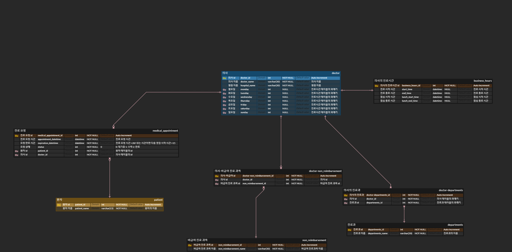

# 예약 서비스 테스트 방법

## 1. 프로젝트 세팅 방법

### 1-1. 가상환경 설정

#### 가상환경 생성 : python -m venv venv

#### 가상환경 실행 : myenv\Scripts\activate

### 1-2. 패키지 설치

#### pip install -r requirements.txt

### 1-3. 프로젝트 실행

#### cd meraki_django

#### python manage.py runserver

## 2. 데이터 생성

### swagger 접속

### http://127.0.0.1:8000/swagger/

### 필요한 id 값은 목록 api 에서 얻을 수 있습니다.

## 2-1 . 의사 데이터 생성

### /doctor/create/

### {

### "doctor_name": "의사 이름 입력",

### "hospital_name": "병원 이름 입력",

### "department_name": "진료과 입력",

### "non_reimbursement_name": "비급여 과목 입력",

### "monday": "08:00:00 17:00:00 12:00:00 13:00:00" (진료 시작 시간, 진료 종료 시간, 점심 시작 시간, 점심 종료 시간),

### "tuesday": "08:00:00 17:00:00 12:00:00 13:00:00" (진료 시작 시간, 진료 종료 시간, 점심 시작 시간, 점심 종료 시간),

### "wednesday": "08:00:00 17:00:00 12:00:00 13:00:00" (진료 시작 시간, 진료 종료 시간, 점심 시작 시간, 점심 종료 시간),

### "thursday": "08:00:00 17:00:00 12:00:00 13:00:00" (진료 시작 시간, 진료 종료 시간, 점심 시작 시간, 점심 종료 시간),

### "friday": "08:00:00 17:00:00 12:00:00 13:00:00" (진료 시작 시간, 진료 종료 시간, 점심 시작 시간, 점심 종료 시간),

### "saturday": "08:00:00 17:00:00 12:00:00 13:00:00" (진료 시작 시간, 진료 종료 시간, 점심 시작 시간, 점심 종료 시간),

### "sunday": "08:00:00 17:00:00 12:00:00 13:00:00" (진료 시작 시간, 진료 종료 시간, 점심 시작 시간, 점심 종료 시간)

### }

## 2-2. 환자 생성

### /appointments/patient

### 환자 이름 입력

## 2-3. 입력시간에 영업중인 의사

### /doctor/open/

### 2022-08-15 08:00:00 해당 형식으로 입력

## 2-4. 의사 검색

### /doctor/search/

### 검색 내용 입력

## 2-5. 진료 요청

### /appointments/request/

### 환자의 id 와 의사의 id 입력 예약시간(2022-08-15 08:00:00) 입력

### 트리거를 이용해 현재 시간이 만료 시간 이후이면 만료로 설정

## 2-6. 진료 요청 목록

### /appointments/search/

### 의사 id 입력

## 2-7. 진료 요청 수락

### /appointments/accept/

### 진료 요청 id 입력

# 설계 db diagram

|                          |                             |             |     |     |     |          |        |        |                                          |       |
| ------------------------ | --------------------------- | ----------- | --- | --- | --- | -------- | ------ | ------ | ---------------------------------------- | ----- |
| 테이블                   | 속성                        | 타입        | pk  | nn  | uq  | 자동증가 | 외래키 | 기본값 | 비고                                     | 비고2 |
| patient                  | patient_id                  | int         | V   | V   | V   | V        |        |        |                                          |       |
|                          | patient_name                | varchar(16) |     | V   |     |          |        |        | 환자 이름                                |       |
|                          |                             |             |     |     |     |          |        |        |                                          |       |
| doctor                   | doctor_id                   | int         | V   | V   | V   | V        |        |        |                                          |       |
|                          | doctor_name                 | varchar(16) |     | V   |     |          |        |        | 의사 이름                                |       |
|                          | hospital_name               | varchar(64) |     | V   |     |          |        |        | 병원이름                                 |       |
|                          | monday                      | int         |     |     |     |          | V      |        | 시간 테이블의 외래키(business_hours_id)  |       |
|                          | tuesday                     | int         |     |     |     |          | V      |        | 시간 테이블의 외래키(business_hours_id)  |       |
|                          | wednesday                   | int         |     |     |     |          | V      |        | 시간 테이블의 외래키(business_hours_id)  |       |
|                          | thursday                    | int         |     |     |     |          | V      |        | 시간 테이블의 외래키(business_hours_id)  |       |
|                          | friday                      | int         |     |     |     |          | V      |        | 시간 테이블의 외래키(business_hours_id)  |       |
|                          | saturday                    | int         |     |     |     |          | V      |        | 시간 테이블의 외래키(business_hours_id)  |       |
|                          | sunday                      | int         |     |     |     |          | V      |        | 시간 테이블의 외래키(business_hours_id)  |       |
|                          |                             |             |     |     |     |          |        |        |                                          |       |
|                          |                             |             |     |     |     |          |        |        |                                          |       |
| doctor-departments       | doctor-departments_id       | int         | V   | V   | V   | V        |        |        | 의사 진료과 id                           |       |
|                          | doctor_id                   | int         |     | V   |     |          | V      |        | 의사 id                                  |       |
|                          | department_id               | int         |     | V   |     |          | V      |        | 진료과 id                                |       |
|                          |                             |             |     |     |     |          |        |        |                                          |       |
| departments              | departments_id              | int         | V   | V   | V   | V        |        |        | 진료과 id                                |       |
|                          | departments_name            | varchar(64) |     | V   |     |          |        |        | 진료과 이름                              |       |
|                          |                             |             |     |     |     |          |        |        |                                          |       |
| business_hours           | business_hours_id           | int         | V   | V   | V   | V        |        |        |                                          |       |
|                          | start_time                  | datetime    |     |     |     |          |        |        | 진료 시작 시간                           |       |
|                          | end_time                    | datetime    |     |     |     |          |        |        | 진료 종료 시간                           |       |
|                          | lunch_start_time            | datetime    |     |     |     |          |        |        | 점심 시작 시간                           |       |
|                          | lunch_end_time              | datetime    |     |     |     |          |        |        | 점심 종료 시간                           |       |
|                          |                             |             |     |     |     |          |        |        |                                          |       |
| non_reimbursement        | non_reimbursement_id        | int         | V   | V   | V   | V        |        |        | 비급여 목록 테이블                       |       |
|                          | non_reimbursement_name      | varchar(30) |     |     |     |          |        |        | 비급여 진료 항목 이름                    |       |
|                          |                             |             |     |     |     |          |        |        |                                          |       |
| doctor-non_reimbursement | doctor-non_reimbursement_id | int         | V   | V   | V   | V        |        |        | 의사 비급여 진료 항목 id                 |       |
|                          | doctor_id                   | int         |     | V   |     |          | V      |        | 의사id                                   |       |
|                          | non_reimbursement_id        | int         |     | V   |     |          | V      |        | 비급여 진료 항목 id                      |       |
|                          |                             |             |     |     |     |          |        |        |                                          |       |
| medical_appointment      | medical_appointment_id      | int         | V   | V   | V   | V        |        |        | 진료 예약 테이블                         |       |
|                          | appointment_datetime        | datetime    |     | V   |     |          |        |        | 요청 예약 시간                           |       |
|                          | expiration_datetime         | datetime    |     | V   |     |          |        |        | 요청 만료 시간                           |       |
|                          | status                      | int         |     | V   |     |          |        | 0      | 진료 요청 상태 0: 대기중 1: 수락 2: 만료 |       |
|                          | patient_id                  | int         |     |     |     |          | V      |        | 환자 테이블의 외래키                     |       |
